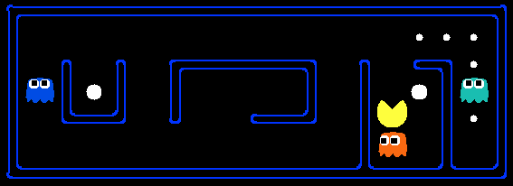

<!-- PROJECT LOGO -->
 

  

<h3 align="center">Reinforcement Learning on Gridworld, Crawler, and Pacman</h3>

  

    This project implements intelligent agents with value iteration and Q-learning to optimize performance of various use cases.
     
    http://ai.berkeley.edu/reinforcement.html
     
  

<!-- TABLE OF CONTENTS -->

  
Table of Contents

  <ol>
    <li>
      <a href="#about-the-project">About The Project</a>
      <ul>
        <li><a href="#built-with">Built With</a></li>
      </ul>
    </li>
    <li><a href="#contact">Contact</a></li>
    <li><a href="#acknowledgments">Acknowledgments</a></li>
  </ol>

<!-- ABOUT THE PROJECT -->
## About The Project

This project was developed by John Denero, Dan Klein, Pieter Abbeel, and many others at the University of California, Berkeley. Please refer to the following
    write-up document for specifics on the project structure and how to navigate/run the files:  http://ai.berkeley.edu/reinforcement.html.  This document provides
    a comprehensive description of the project's content and goals and serves as the core README.

(<a href="#top">back to top</a>)

### Built With

* [Python](https://www.python.org/)

(<a href="#top">back to top</a>)

<!-- CONTACT -->
## Contact

Jack Rogers  - jrogers2400@gmail.com

Project Link: [https://github.com/jrogers2400/Reinforcement-Learning-Project-Gridworld-Pacman-Crawler-.git](https://github.com/jrogers2400/Reinforcement-Learning-Project-Gridworld-Pacman-Crawler-.git)

(<a href="#top">back to top</a>)

<!-- ACKNOWLEDGMENTS -->
## Acknowledgments

* [UC Berkeley AI Project 3: Reinforcement Learning](http://ai.berkeley.edu/reinforcement.html)

(<a href="#top">back to top</a>)

